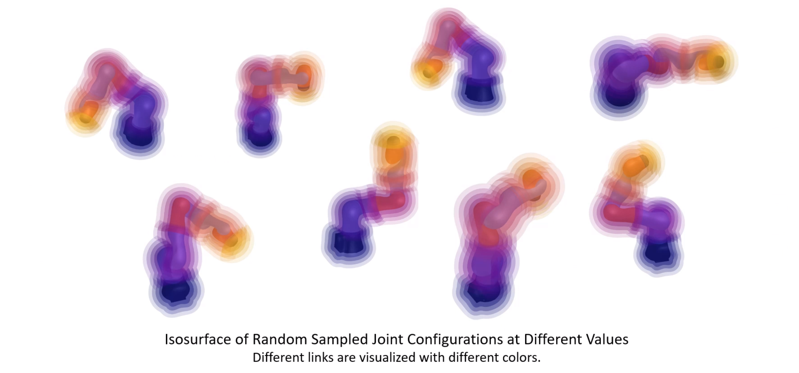

# Robot Neural Distance Function

Implementation for paper "Encoding the Precise Morphology of Articulated Robots with Lightweight Neural Distance Functions" [**ICRA 2025**] 




### Dependencies

- Python 3.8 (tested)
- PyTorch 2.4 (tested)
- numpy 1.24.4 (tested)
- urdfpy 0.0.22 (tested, for data generation and visualization)
- Trimesh 4.4.7 (tested, for data generation and visualization)
- Open3D 0.16.0 (tested, for visualization) 


### Examples

```python
import numpy as np
from models import iiwa_RNDF

if __name__ == '__main__':
    np.random.seed(16)

    # initialize RNDF for KUKA iiwa 7
    iiwa_model = iiwa_RNDF()

    # sample random robot configuration
    random_q = iiwa_model.sample_random_robot_config()
    iiwa_model.set_robot_joint_positions(random_q) # set robot configuration
    iiwa_model.show_robot()
    # print(random_q)

    # sample random point in the robot frame
    point = np.array([0.1, 0.2, 0.3])
    iiwa_model.show_robot_with_points(point)

    # Signed Distance Computation, +1: Outside -1: Inside
    link_wise_dist = iiwa_model.calculate_signed_distance(point, min_dist=False)
    print("Signed Distance to Each Link: {}".format(link_wise_dist[0]))

    minimum_dist = iiwa_model.calculate_signed_distance(point, min_dist=True)
    print("Signed Distance to the Robot: {}".format(minimum_dist[0]))
```


### Roadmap

- [x] IIWA Model Release

- [ ] Dataset Generation

- [ ] Visualization

- [ ] More Robots (Franka Emika Panda, Allegro Hand, ...)

  

